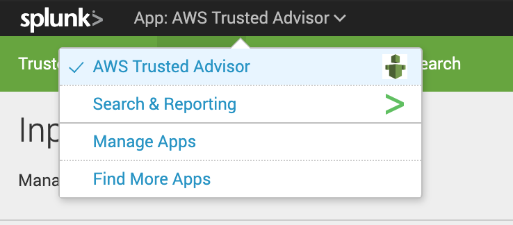
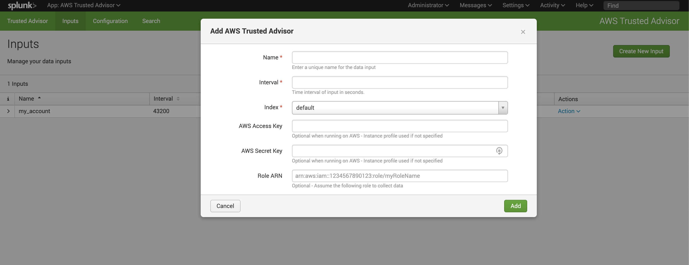
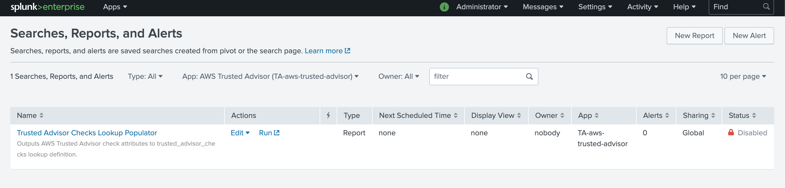
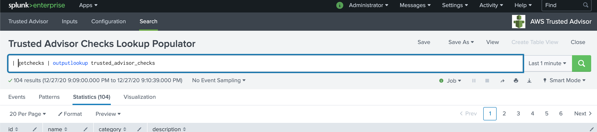
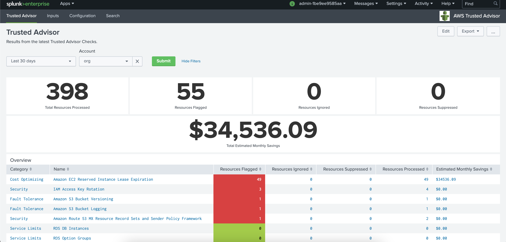
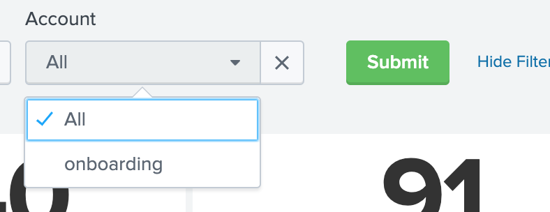
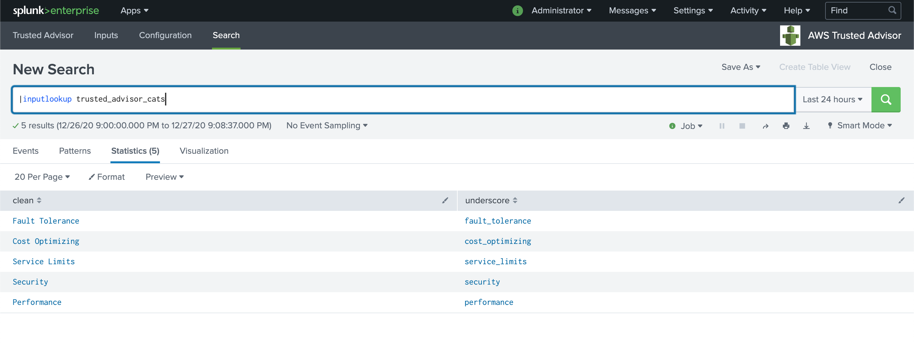

# AWS Trusted Advisor Aggregator

Version 1.0.7 (Released 29th December 2020) . 

## Intro
This app allows you to configure AWS Trusted Advisor reporting directly into Splunk.
AWS Trusted Advisor help you reduce cost, increase performance, and improve security by optimising your AWS environment and is included in Business and Enterprise support packages.

Using this app you can configure a number of AWS accounts with ease and a pre-build dashboard displays your Trusted Advisor recommendations in one place, for all accounts, with the option of breaking down per account. 


Credit to Hurricane Labs who built the foundations to this app which included data collection and dashboard.  

[Check out more information on Trusted Advisor and the capabilities](https://aws.amazon.com/premiumsupport/ta-iam/)
#### How the app works
TBC

## Installation
#### Requirements
* The app requires AWS credentials in order to collect data from AWS Trusted Advisor, this can be through the use of an Instance Profile, IAM User and/or IAM Role.
* The AWS Credentials configured must have at least the following Permissions in order to query Trusted Advisor
```
{
       "Version": "2012-10-17",
       "Statement": [
           {
               "Effect": "Allow",
               "Action": "trustedadvisor:Describe*",
               "Resource": "*"
           }
       ]
   }
```

#### Docker deployment
This app has been tested in a standalone container using the following command:  
``docker run -d -v $(pwd):/opt/splunk/etc/apps/TA-aws-trusted-advisor -p 8009:8000 -e "SPLUNK_START_ARGS=--accept-license" -e "SPLUNK_PASSWORD=MyPassword1" --name splunktaaws splunk/splunk:latest``  
 
 During testing, varying AWS IAM configurations were tested, including:
 * Standalone IAM User (Access/Secret Key)  
 * Assume Role using IAM User (Access/Secret Key + Role ARN)
 * Assume Role using Instance Profile (when running from an AWS EC2 host with appropriate credentials)  
 
The app has been tested on the latest 7.3 and 8.1 Splunk Enterprise builds.

#### Installation on existing deployments

The app was designed to be installed on an All-In-One (AIO) instance, or onto your Search Head(s), however alternative configurations are possible.

The app does not need installing on your indexing tier.

It is possible to run the the modular input section of the app on a heavy-forwarder or an [IDM](https://www.splunk.com/en_us/blog/platform/introducing-inputs-data-manager-on-splunk-cloud.html), however you will also need to install the app on your search head(s).

## Configuration
| # |           |          |
| --- | --- |:---:|
| 1 | Once installed, navigate to the app using the dropdown at the top of the Splunk UI. |  |
| 2 | Navigate to the "Inputs" tab. | |
| 3 | Create a new input:<br /><br />*Name*: Something to identify your this input from any other AWS accounts you are monitoring<br /><br />*Interval*: How often to scrape the Trusted Advisor check results, recommended value 43200 (every 12 hours)<br /><br />*Index*: The name of the index that you want the scraped data to go into. Note: the `trusted-advisor-index` macro will need updating to match your chosen index (index=main by default).<br /><br />*AWS Access Key*: The Access Key of the IAM user to use to connect, not required if you're running on your Splunk instance on AWS using an [Instance Profile](https://docs.aws.amazon.com/IAM/latest/UserGuide/id_roles_use_switch-role-ec2_instance-profiles.html)<br /><br />*AWS Secret Key*: As above<br /><br />*Role ARN*: Set thi to an AWS IAM Role ARN if your IAM User/Instance Profile is required to assume a different role to access Trusted Advisor (e.g. accessing other accounts). |  |
| 4 | Enable the saved search "Trusted Advisor Checks Lookup Populator" - This is used to generate the metadata used in the dashboards to display the various Trusted Advisor checks. |  |
| 5 | Manually run the saved search or manually run `\| getchecks \| outputlookup trusted_advisor_checks` |  |

## Operation



## Troubleshooting


